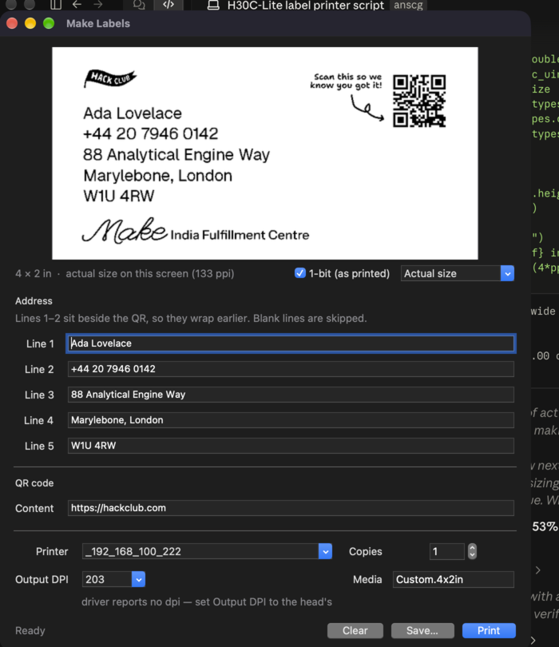

# shipshape

4 × 2" thermal shipping labels for the Hack Club Make fulfillment centre (H30C-Lite).

Fills the designer's label artwork with five address lines and a QR code, then
prints it to the thermal printer.

```bash
./run.sh
```



## What it does

- Renders the artwork from the original vector `frame.svg` — the flag, the
  "Scan this so we know you got it!" caption and arrow, and the *Make* wordmark
  are the designer's own paths, not a re-drawing.
- Sets the address in **Geist Regular** at the measured size, position, and
  leading of the original (font size 30, 39 units of leading, first baseline at
  134.17, all in the frame's 799 × 399 unit space — 4 × 2 inches).
- Generates the QR at the designer's box, with each module snapped to a whole
  number of printer dots so it stays crisp on a 203 dpi head.
- Previews at **203 dpi, 1-bit**, one screen pixel per printer dot — what you
  see is the dot pattern that lands on the label, not a smoothed mock-up.
- Prints via CUPS on a 4 × 2 in page, with no `fit-to-page`, so the driver
  never rescales the dot grid.

### A caveat on 1-bit and dpi

1-bit output is exactly right **only when the render dpi matches the print
head's own dpi** — then each pixel is one dot and the driver passes it through
untouched. At any other dpi the driver rescales a 1-bit image and the edges
smear, which is worse than sending greyscale and letting it halftone.

203 dpi is the usual thermal head and is what the app assumes, but it has not
been verified against the actual H30C-Lite. The app reads `*DefaultResolution`
from the selected queue's PPD and shows it under the printer picker; when the
driver reports one, set Output DPI to match. If the head turns out to be 300
dpi, the text will print noticeably cleaner than the 203 dpi preview suggests —
at 203 dpi the cap height is only ~23 dots, so thresholding leaves stems
visibly uneven.

The address weight is selectable — Regular, Medium or SemiBold. It is worth
reaching for: a thermal head is binary, so a stem that lands under a single
dot does not print at all, and stepping up a weight is the usual cure for
text that comes out patchy. Regular is the default because it is what the
designer set the artwork in.

Lines that run too wide shrink to fit rather than overflowing. Lines 1–2 sit
beside the QR so they wrap earlier than 3–5. Blank lines are skipped.

The window is resizable and the preview is the part that gives. Three views:

- **Actual size** (default) — the label at its true physical dimensions, using
  the panel's real ppi from CoreGraphics rather than Tk's fabricated 96 dpi.
  This is what the printed label looks like in the hand.
- **Dot grid 1:1** — one screen pixel per printer dot. On a Retina laptop this
  is around 150% of life size, so it magnifies the stair-stepping; useful for
  checking the dots, misleading as a quality judgement.
- **Fit window** — fills whatever room there is.

The caption always states the size relative to paper, so the preview never
quietly flatters or maligns the output. Minimum window is 460 × 604, which
fits a 1280 × 800 laptop.

## CLI

```bash
./run.sh --line1 "Fiona Hackworth" --line2 "+44 20 7946 0142" \
         --line3 "88 Analytical Engine Way" \
         --line4 "Marylebone, London" --line5 "W1U 4RW" \
         --qr "https://hackclub.com" --out label.png
```

| flag | meaning |
| --- | --- |
| `--out FILE` | write a `.png` or `.pdf` instead of opening the GUI |
| `--print` | send to the printer |
| `--printer NAME` | CUPS queue (default: the system default) |
| `--copies N` | number of labels |
| `--dpi N` | 203 (printer native), 300, or 600 |
| `--media NAME` | CUPS media name, default `Custom.4x2in` |
| `--grayscale` | keep anti-aliased edges instead of 1-bit thermal output |
| `--list-printers` | show available CUPS queues |

## Layout

Everything is in `label_render.py` as constants in the frame's user units, so
if the design moves, edit those rather than the drawing code:

| constant | meaning |
| --- | --- |
| `TEXT_X` | left edge of the address block |
| `BASELINE_1`, `LINE_PITCH` | first baseline and leading |
| `FONT_SIZE` | address size |
| `QR_X`, `QR_Y`, `QR_SIZE` | the QR box |
| `LINE_MAX_X` | per-line right-hand limit before shrink-to-fit |

## Setup

macOS 27 ships a broken Tk 8.5 (ttk widgets and canvases don't draw at all), so
the app runs from a venv built on Homebrew's Python 3.12 with Tk 9:

```bash
brew install python-tk@3.12
/opt/homebrew/bin/python3.12 -m venv .venv
./.venv/bin/pip install pillow qrcode
```

`run.sh` uses that venv. `rsvg-convert` is used when present to re-rasterise the
frame at the exact output size; without it, the bundled 600 dpi
`assets/frame@600.png` is resampled instead.

## Assets

| file | source |
| --- | --- |
| `assets/frame.svg` | the designer's artwork, text and QR removed |
| `assets/frame@600.png` | 600 dpi fallback raster of the above |
| `assets/Geist-Regular.ttf` | Geist, the address face |

## Credits and licensing

- The code is MIT (`LICENSE`).
- `assets/frame.svg` is the label artwork as drawn by Hack Club's designer, and
  the Hack Club flag and *Make* wordmark in it are Hack Club's marks. They are
  here so the tool can reproduce the label; they are not covered by the MIT
  grant and are not yours to reuse.
- `assets/Geist-{Regular,Medium,SemiBold}.ttf` are Geist v1.800 by the Geist
  Project Authors, under the SIL Open Font License 1.1 — see
  `assets/Geist-LICENSE.txt`.
